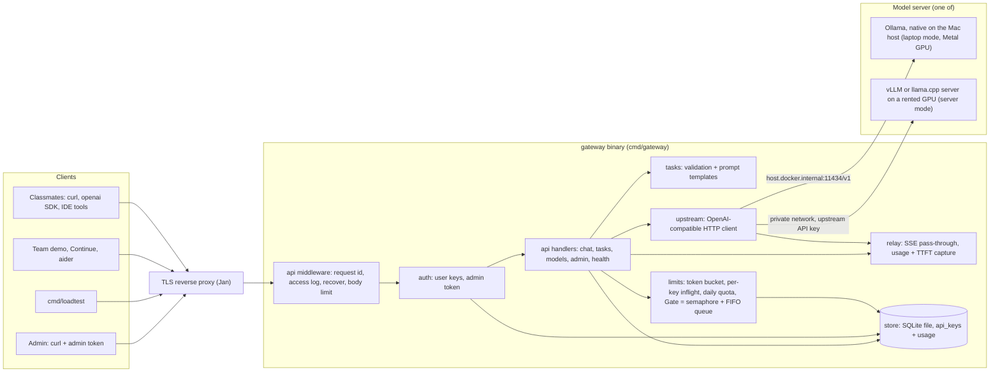
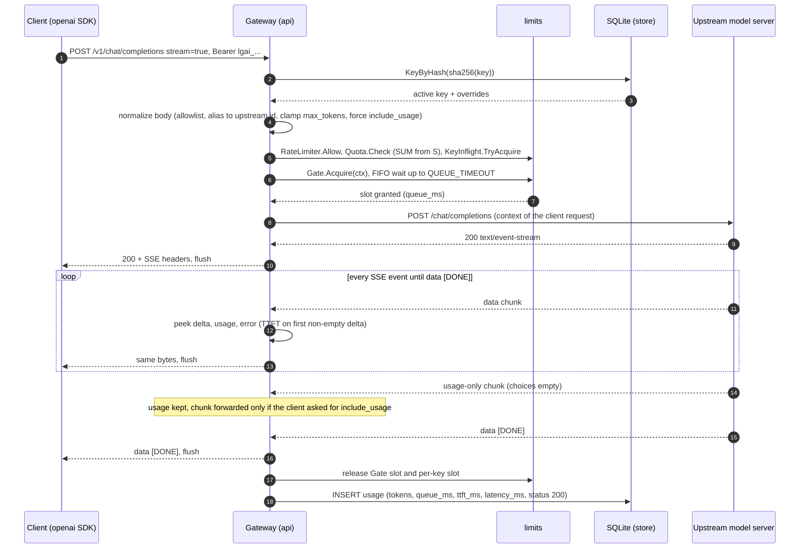
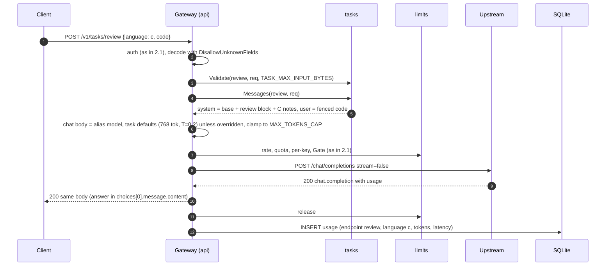

# Architecture: local-generative-ai gateway

> **Superseded in places by [`docs/DECISIONS.md`](DECISIONS.md) and the review fixes** ([`reviews/code-review.md`](reviews/code-review.md), [`reviews/security-code.md`](reviews/security-code.md)). Where this document disagrees with the code, the code and DECISIONS win. Concrete deltas:
>
> - **Admission order:** auth → maintenance → per-key rejected-request bucket (30/min, burst 10) → **per-key in-flight slot, taken before the body is read** → body read + validation → rate → quota → gate. The rate token is refunded when the gate refuses (503) or the client leaves; a quota 429 keeps it (security-code V1/V2, code-review M1). This replaces §2 steps 2–8.
> - **No usage rows for pre-admission rejections** (400/408/413 and per-key 429s before validation); they are only logged, like 401s. Usage rows are written only for requests that passed validation (security-code V2).
> - **Task defaults:** review is **1024** `max_tokens` (was 768; code-review m4). The §6 table is otherwise unchanged.
> - **Chat input cap:** `LGAI_CHAT_MAX_INPUT_BYTES` = **16384** (16 KiB, was 24 KiB; code-review m5).
> - **Body-read timeout:** `LGAI_BODY_READ_TIMEOUT` = **10s** (was 30s; security-code V1).
> - **Admin API on its own listener:** `LGAI_ADMIN_ADDR` (default `127.0.0.1:8081`), started only with a valid token; the public router has no `/admin` unless `LGAI_ADMIN_ON_PUBLIC=true` (D5, security #1). This answers §17 Q5 and replaces the single-port design in §7 and §12. Also new: `/admin/keys/batch`, `/admin/keys/revoke`, `/admin/maintenance`.
> - **D4 scope cuts:** a buffered-channel semaphore gate instead of strict FIFO hand-off; one `*sql.DB` with `SetMaxOpenConns(1)` instead of two pools; no `/admin/usage` (use `GET /admin/keys/{id}/usage` + `scripts/report.sql`); `srv.Shutdown(30s)` + `db.Close()` instead of the six-step shutdown; one generic mid-stream error event (`upstream_error`) plus the idle watchdog instead of the cause taxonomy; the minimal load tester of D8 instead of §14.
> - **Knob values:** the D6 table (laptop and server columns) replaces the §8/§9 defaults and the §9 `.env` examples; see `.env.laptop.example` / `.env.server.example`.
> - **Topology:** D2 as decided: gateway + SQLite on a separate always-on CPU VM behind Caddy; vLLM on Modal is only the upstream (`docs/HANDOFF-jan.md`).
> - **Schema:** the real schema is [`internal/store/schema.sql`](../internal/store/schema.sql); `docs/db-schema.sql` is only a pointer now.

| | |
|---|---|
| Status | Design, 2026-09-30. Not implemented yet |
| Owner | Architect agent (also owns the DB schema) for Slava |
| Source of truth | [`docs/PRD.md`](PRD.md). Nothing here adds scope beyond it |
| Related | [`api/openapi.yaml`](../api/openapi.yaml), [`docs/db-schema.sql`](db-schema.sql), ADRs [0001](adr/0001-go-gateway-in-front-of-openai-compatible-upstream.md) · [0002](adr/0002-sqlite-driver-modernc.md) · [0003](adr/0003-task-endpoints-return-chat-completion-shape.md) · [0004](adr/0004-streaming-usage-accounting.md) |

The gateway is one Go 1.26 binary (module `local-generative-ai`) with one SQLite file. It sits in front of exactly one OpenAI-compatible model server and adds:

- per-person keys
- limits
- a fair queue
- task prompts
- usage stats without content

Anything the PRD marks as out of scope is out: web UI, FIM, content storage, multi-node, RAG, cloud/TLS/CI.

---

## 1. Context and components



**Deployment modes** (FR8). Only env vars differ, never code:

| | Laptop mode | Server mode |
|---|---|---|
| Model server | Ollama **native on macOS**. Docker on macOS can't use the Metal GPU | vLLM (preferred for 30 users: continuous batching) or llama.cpp `llama-server` |
| Gateway | `docker compose up` on the Mac, or `go run ./cmd/gateway` | Container next to the model server (Jan) |
| Upstream URL | `http://host.docker.internal:11434/v1` (container) or `http://127.0.0.1:11434/v1` (native) | `http://vllm:8000/v1` on a private Docker network |
| Public model name | `coder` → e.g. `gpt-oss:20b` (already pulled on the Mac) | `coder` → the served model id from `docs/research/` |

The public alias (`LGAI_MODELS=coder=<upstream id>`) keeps Szymon's exercises unchanged when we fall back to laptop mode.

---

## 2. Request pipeline

Every generation request (chat and tasks) goes through the same steps in this order. Cheap local checks run first. Limiters are only charged for requests that could actually run.

| # | Step | Where | Failure → response |
|---|---|---|---|
| 1 | Request id, access log, panic recovery | `api` middleware | 500 `internal_error` |
| 2 | Body cap (`http.MaxBytesReader`) + body read deadline | `api` middleware | 413 `request_too_large` |
| 3 | Bearer key → SHA-256 → lookup, not revoked | `auth` | 401 `invalid_api_key` |
| 4 | Decode + validate + normalize (allowlist, alias, `max_tokens`) or build task prompt | `api` + `tasks` | 400 / 404 `model_not_found` / 404 `unknown_task` / 413 |
| 5 | Per-key token bucket (`rpm`, `burst`) | `limits.RateLimiter` | 429 `rate_limit_exceeded`, `Retry-After` = refill time |
| 6 | Daily token quota (SUM from SQLite since 00:00 UTC) | `limits.Quota` | 429 `insufficient_quota`, `Retry-After` = until 00:00 UTC, `X-Should-Retry: false` |
| 7 | Per-key concurrent requests | `limits.KeyInflight` | 429 `concurrency_limit_exceeded`, `Retry-After: 1` |
| 8 | Global slot: semaphore `MAX_INFLIGHT` + FIFO queue `QUEUE_SIZE`, max wait `QUEUE_TIMEOUT` | `limits.Gate` | 503 `server_overloaded`, `Retry-After` = `OVERLOAD_RETRY_AFTER` |
| 9 | Upstream call (ctx = request ctx) | `upstream` | 502 `upstream_error`/`upstream_unavailable`, 503 (upstream 429/503), 504 `upstream_timeout` |
| 10 | Relay (stream or JSON) | `relay` | mid-stream: SSE error event (§7) |
| 11 | Release slot and per-key token, INSERT usage row (`context.WithoutCancel`, 2 s timeout) | `api` + `store` | logged only; never fails the request |

Steps 5–8 are skipped for `/v1/models`, which is auth only, served from config, and not recorded. The health and admin endpoints skip them too. Usage rows are written for every request that passed step 3 (400s and 429s included). 401s are logged only (see `db-schema.sql`).

### 2.1 Streaming chat



Failure paths (details in §7):

- The client disconnects. The upstream ctx is cancelled and the connection is closed. The row is recorded with status 499 and partial tokens.
- The upstream dies mid-stream, or goes silent longer than `UPSTREAM_IDLE_TIMEOUT`. The client gets one `data: {"error":…}` event and no `[DONE]`. The row is recorded as 502 or 504.

### 2.2 Task endpoint (non-streaming shown; streaming uses the same relay as 2.1)



---

## 3. Go package layout

```
local-generative-ai/
├── cmd/
│   ├── gateway/     main.go: wiring, signals, graceful shutdown; `gateway healthcheck` subcommand for Docker
│   └── loadtest/    main.go: FR9 load generator (stdlib only)
├── internal/
│   ├── config/      env → Config, validation, secret redaction
│   ├── oai/         OpenAI wire types, error envelope, chat-request normalization (pure functions)
│   ├── auth/        key generation/hashing, bearer parsing, user-key + admin-token middleware
│   ├── store/       SQLite: open, pragmas, embedded schema, keys, usage, summaries
│   ├── limits/      RateLimiter (token bucket), KeyInflight, Quota, Gate (semaphore + FIFO queue)
│   ├── upstream/    HTTP client for the OpenAI-compatible model server, status mapping, readiness
│   ├── relay/       SSE relay + JSON relay; captures usage/TTFT; mid-stream errors; client disconnect
│   ├── tasks/       task + language enums, request validation, embedded prompt templates, defaults
│   └── api/         router (ServeMux patterns), middleware, handlers, generation pipeline, admin
├── api/openapi.yaml
├── docs/ …
├── Dockerfile, docker-compose.yml, .env.laptop.example, .env.server.example
└── go.mod           (one direct third-party dependency: modernc.org/sqlite)
```

Import direction has no cycles:

- `api` → {`auth`, `limits`, `relay`, `tasks`, `upstream`, `store`, `config`, `oai`}
- `relay`, `tasks` and `upstream` → `oai` (and `config` for `upstream`)
- `auth` → `store` (types only, via the `KeyLookup` interface) and `config` (default limits)
- `limits` → nothing internal (it defines `UsageReader`)
- `cmd/loadtest` → `oai` only

### 3.1 Key types and signatures (bodies intentionally omitted)

```go
// ---- internal/config ----
type Config struct {
    Addr       string       // LGAI_ADDR
    DBPath     string       // LGAI_DB_PATH
    LogLevel   slog.Level   // LGAI_LOG_LEVEL
    AdminToken string       // LGAI_ADMIN_TOKEN; "" disables /admin/*
    Models     []ModelAlias // LGAI_MODELS; Models[0] is the default
    Upstream   Upstream
    Limits     Limits
    Gen        Gen
    HTTP       HTTP
}
type ModelAlias struct{ Public, Upstream string }
type Upstream struct {
    BaseURL, HealthURL *url.URL // HealthURL nil → BaseURL + "/models"
    APIKey             string
    HeaderTimeout, IdleTimeout, TotalTimeout time.Duration
}
type Limits struct {
    MaxInflight, QueueSize             int
    QueueTimeout, OverloadRetryAfter   time.Duration
    RateRPM, RateBurst, KeyMaxInflight int
    TokenQuotaDaily                    int64
}
type Gen struct{ ChatDefaultMaxTokens, MaxTokensCap, TaskMaxInputBytes int }
type HTTP struct {
    MaxBodyBytes                                          int64
    ReadHeaderTimeout, BodyReadTimeout, WriteTimeout      time.Duration
    IdleTimeout, ShutdownTimeout                          time.Duration
}
func Load(getenv func(string) string, environ []string) (Config, []string /*warnings*/, error)
func (c Config) ResolveModel(public string) (ModelAlias, bool) // "" → Models[0]
func (c Config) LogValue() slog.Value                            // secrets shown as "set"/"unset"

// ---- internal/oai ----
type ErrorResponse struct{ Error Error `json:"error"` }
type Error struct {
    Message string  `json:"message"`
    Type    string  `json:"type"`
    Code    string  `json:"code"`
    Param   *string `json:"param"`
    Status     int           `json:"-"` // HTTP status to send
    RetryAfter time.Duration `json:"-"` // >0 → Retry-After header
    NoRetry    bool          `json:"-"` // → X-Should-Retry: false
}
func (e *Error) Error() string
func NewError(status int, typ, code, param, msg string) *Error
type Message struct{ Role, Content string }             // json:"role","content"
type StreamOptions struct{ IncludeUsage bool `json:"include_usage"` }
type ChatRequest struct {                                // built by tasks
    Model         string         `json:"model"`
    Messages      []Message      `json:"messages"`
    Stream        bool           `json:"stream"`
    StreamOptions *StreamOptions `json:"stream_options,omitempty"`
    MaxTokens       int            `json:"max_tokens"`
    Temperature     float64        `json:"temperature"`
    TopP            *float64       `json:"top_p,omitempty"`
    TopK            *int           `json:"top_k,omitempty"`            // ignored by Ollama
    PresencePenalty *float64       `json:"presence_penalty,omitempty"`
}
type Usage struct{ PromptTokens, CompletionTokens, TotalTokens int } // snake_case json tags
type ChunkPeek struct { // minimal decode of one SSE data payload
    Choices []struct {
        Delta struct {
            Content, Reasoning, ReasoningContent *string
            ToolCalls                            json.RawMessage
        } `json:"delta"`
    } `json:"choices"`
    Usage  *Usage          `json:"usage"`
    Error  json.RawMessage `json:"error"`
    Object string          `json:"object"` // "error" on some backends
}
type NormalizePolicy struct {
    Resolve                        func(public string) (upstreamID string, ok bool)
    DefaultMaxTokens, MaxTokensCap int
}
type Normalized struct {
    Body             []byte // re-encoded request for upstream
    PublicModel      string
    Stream           bool
    ClientWantsUsage bool
    PromptBytes      int    // for the usage fallback estimate
}
func NormalizeChat(raw []byte, p NormalizePolicy) (Normalized, *Error)

// ---- internal/auth ----
const Prefix = "lgai_"                                   // key = Prefix + base64url(32 random bytes) = 48 chars
func Generate() (plaintext string, hash [32]byte, displayPrefix string, err error)
func Hash(plaintext string) [32]byte
func WellFormed(plaintext string) bool                   // prefix, length, charset: rejects garbage before DB
type KeyLookup interface {
    KeyByHash(ctx context.Context, hash [32]byte) (store.Key, error) // store.ErrNotFound
}
type Principal struct {                                   // effective limits after per-key overrides
    KeyID                         int64
    Name                          string
    RPM, Burst, MaxInflight       int
    DailyQuota                    int64
}
func RequireKey(l KeyLookup, defaults config.Limits, next http.Handler) http.Handler
func RequireAdmin(token string, next http.Handler) http.Handler
func PrincipalFrom(ctx context.Context) (Principal, bool)

// ---- internal/store ----
var ErrNotFound = errors.New("store: not found")
type Store struct{ /* w *sql.DB (max 1 conn), r *sql.DB (max 4 conns) */ }
func Open(ctx context.Context, path string) (*Store, error) // DSN pragmas, schema, user_version check
func (s *Store) Close() error
func (s *Store) Ping(ctx context.Context) error
type Key struct {
    ID                                    int64
    Name, Prefix                          string
    CreatedAt                             time.Time
    RevokedAt, LastUsedAt                 *time.Time
    RPMLimit, DailyTokenQuota, MaxInflight *int64 // nil = env default, 0 = unlimited
}
type NewKey struct {
    Name, Prefix                          string
    Hash                                  [32]byte
    RPMLimit, DailyTokenQuota, MaxInflight *int64
}
func (s *Store) CreateKey(ctx context.Context, k NewKey, now time.Time) (Key, error)
func (s *Store) KeyByHash(ctx context.Context, hash [32]byte) (Key, error)
func (s *Store) ListKeys(ctx context.Context) ([]Key, error)
func (s *Store) RevokeKey(ctx context.Context, id int64, now time.Time) (Key, error) // idempotent
type UsageRow struct {
    TS                               time.Time
    RequestID, Endpoint              string
    Model, Language, ErrorCode       string // "" → NULL
    KeyID                            int64
    Stream, Estimated                bool
    Status                           int
    PromptTokens, CompletionTokens   int
    Queue, TTFT                      *time.Duration // nil → NULL
    Latency                          time.Duration
}
func (s *Store) InsertUsage(ctx context.Context, u UsageRow) error
func (s *Store) TokensSince(ctx context.Context, keyID int64, since time.Time) (int64, error)
type UsageSummary struct { /* fields = openapi UsageSummary */ }
func (s *Store) Summaries(ctx context.Context, keyID int64 /*0 = all*/, since, until time.Time) ([]UsageSummary, error)

// ---- internal/limits ----
type Clock func() time.Time
type RateLimiter struct{ /* mu; buckets map[int64]*bucket; now Clock */ }
func NewRateLimiter(now Clock) *RateLimiter
func (l *RateLimiter) Allow(keyID int64, rpm, burst int) (ok bool, retryAfter time.Duration) // rpm 0 → ok
type KeyInflight struct{ /* mu; n map[int64]int */ }
func (k *KeyInflight) TryAcquire(keyID int64, max int) (release func(), ok bool)              // max 0 → ok
var ErrQueueFull, ErrQueueTimeout, ErrClosed, ErrQuotaExceeded error
type Gate struct{ /* mu; inflight, max, queueSize int; waiters *list.List of chan struct{}; timeout */ }
func NewGate(maxInflight, queueSize int, queueTimeout time.Duration) *Gate
func (g *Gate) Acquire(ctx context.Context) (release func(), waited time.Duration, err error)
func (g *Gate) Stats() (inflight, queued int)
func (g *Gate) Close()                                     // shutdown: fail all waiters with ErrClosed
type UsageReader interface {
    TokensSince(ctx context.Context, keyID int64, since time.Time) (int64, error)
}
type Quota struct{ /* r UsageReader; now Clock */ }
func NewQuota(r UsageReader, now Clock) *Quota
func (q *Quota) Check(ctx context.Context, keyID, limit int64) (retryAfter time.Duration, err error) // limit 0 → nil

// ---- internal/upstream ----
type Client struct{ /* base, health *url.URL; apiKey string; hc *http.Client */ }
func New(cfg config.Upstream, maxConns int) *Client
// 2xx: caller owns resp.Body. Non-2xx / transport error: body drained+closed, mapped *oai.Error returned.
func (c *Client) ChatCompletions(ctx context.Context, body []byte, requestID string) (*http.Response, error)
func (c *Client) Ready(ctx context.Context) error
func (c *Client) ModelIDs(ctx context.Context) ([]string, error) // startup sanity warning only
func MapStatus(status int, retryAfter string, body []byte) *oai.Error

// ---- internal/relay ----
type Options struct {
    Start            time.Time     // request arrival; TTFT reference
    ClientWantsUsage bool
    PromptBytes      int
    IdleTimeout      time.Duration // max silence between upstream events
    WriteTimeout     time.Duration // per client write
    MaxEventBytes    int           // guard, 1 MiB
    Now              func() time.Time
}
type Outcome struct {
    Status         int    // effective: 200, 499, 502, 503, 504
    ErrCode        string
    Usage          oai.Usage
    UsageEstimated bool
    TTFT           time.Duration // 0 = no token seen
    BytesOut       int64
}
func Stream(ctx context.Context, w http.ResponseWriter, body io.ReadCloser, cancel context.CancelCauseFunc, o Options) Outcome
func JSON(w http.ResponseWriter, resp *http.Response, o Options) Outcome

// ---- internal/tasks ----
type Kind string     // "explain" | "review" | "tests" | "fix"
type Language string // "python" | "java" | "go" | "c" | "cpp"
func ParseKind(s string) (Kind, bool)
type Request struct {
    Language      Language           `json:"language"`
    Code          string             `json:"code"`
    Error         string             `json:"error,omitempty"`
    Instructions  string             `json:"instructions,omitempty"`
    Framework     string             `json:"framework,omitempty"`
    Model         string             `json:"model,omitempty"`
    Stream        bool               `json:"stream,omitempty"`
    StreamOptions *oai.StreamOptions `json:"stream_options,omitempty"`
    MaxTokens     *int               `json:"max_tokens,omitempty"`
    Temperature   *float64           `json:"temperature,omitempty"`
}
type Defaults struct{ MaxTokens int; Temperature float64 }
func DefaultsFor(k Kind) Defaults
func Decode(r io.Reader) (Request, *oai.Error)                     // DisallowUnknownFields
func (r Request) Validate(k Kind, maxInputBytes int) *oai.Error
func Messages(k Kind, r Request) []oai.Message                      // renders embedded text/templates

// ---- internal/api ----
type Deps struct {
    Cfg      config.Config
    Store    *store.Store
    Upstream *upstream.Client
    Rate     *limits.RateLimiter
    PerKey   *limits.KeyInflight
    Gate     *limits.Gate
    Quota    *limits.Quota
    Log      *slog.Logger
    Now      func() time.Time
    Draining *atomic.Bool
    Inflight *sync.WaitGroup // generation handlers, waited on before store.Close
}
func NewRouter(d Deps) http.Handler
// Routes (Go 1.22+ patterns). A catch-all "/" returns a JSON 404, so no plain-text 404/405 escapes:
//   GET  /healthz                    GET  /readyz
//   GET  /v1/models                  POST /v1/chat/completions      POST /v1/tasks/{task}
//   POST /admin/keys   GET /admin/keys   DELETE /admin/keys/{id}
//   GET  /admin/keys/{id}/usage      GET  /admin/usage              (only registered if AdminToken != "")
```

---

## 4. Dependency policy

**Standard library first.** In use:

- `net/http` with Go 1.22 method/wildcard patterns and `Request.Pattern` for route logging
- `http.ResponseController` (Flush and per-request read/write deadlines)
- `log/slog` (JSON), `crypto/rand`, `crypto/sha256`, `crypto/subtle`, `encoding/base64`
- `text/template` + `embed` (prompts and schema), `container/list` (FIFO queue)
- `context` (`WithoutCancel`, `WithCancelCause`), `testing/synctest` (Go 1.25+, deterministic limiter tests)

| Dependency | Why it is allowed |
|---|---|
| `modernc.org/sqlite` v1.60.x (+ its pinned `modernc.org/libc`) | The PRD requires SQLite, and this is the only way to keep `CGO_ENABLED=0`, static binaries and cross-compilation to linux/amd64 + arm64 ([ADR 0002](adr/0002-sqlite-driver-modernc.md)). |

**Rejected:**

- `golang.org/x/time/rate`. A token bucket with an exact `Retry-After` is about 25 lines, and `rate.Reservation` makes "peek the delay without consuming" awkward.
- `x/sync/semaphore`. We need a bounded queue length anyway, so a mutex + `container/list` is simpler.
- Routers (chi/gin), UUID libs, env libs (`envconfig`), OpenAI SDKs for Go: the stdlib covers each of these.

Adding any dependency needs a one-line justification in this table.

---

## 5. SSE streaming proxy design (relay)

Verified upstream behaviour is summarized in [ADR 0004](adr/0004-streaming-usage-accounting.md), with sources.

### 5.1 Request side

- `stream: true` → the gateway sets `stream_options.include_usage = true` upstream and remembers whether the client asked for it.
- `max_completion_tokens` is renamed to `max_tokens`. Ollama's request struct has no `max_completion_tokens` field and silently ignores it ([openai.go](https://github.com/ollama/ollama/blob/main/openai/openai.go)).
- Allowlisted fields only. That list: `model`, `messages`, `stream`, `stream_options`, `max_tokens`, `max_completion_tokens`, `temperature`, `top_p`, `top_k` (vLLM/llama.cpp), `stop`, `seed`, `frequency_penalty`, `presence_penalty`, `response_format`, `tools`, `tool_choice`, `parallel_tool_calls`, `logprobs`, `top_logprobs`, `n` (only 1), `reasoning_effort`, `chat_template_kwargs`. The last one is a vLLM/llama.cpp extension that Ollama ignores, e.g. `{"enable_thinking": false}` for Qwen3-style thinking models. It only affects the caller's own request. Everything else is dropped, in particular Ollama's `keep_alive`, with which any client could unload the model for everyone.
- Upstream transport:
  - `DisableCompression: true`, so there is never a gzip-buffered SSE.
  - `Proxy: nil`, so the environment's `HTTP_PROXY` never captures model traffic.
  - `MaxIdleConnsPerHost = MaxInflight`, dial timeout 5 s.
  - `ResponseHeaderTimeout = UPSTREAM_HEADER_TIMEOUT` (covers a cold model load).
  - Total cap = `context.WithTimeout(UPSTREAM_TIMEOUT)`.

### 5.2 Before the first byte to the client

Upstream non-2xx or a transport error is mapped by `upstream.MapStatus` into a normal JSON error with the correct status:

- 400/422 → 400 (`context_length_exceeded` if the message says so, else `invalid_value`)
- 401/403/404 → 502 (our misconfiguration: wrong upstream key or model not pulled; logged at ERROR)
- 429/503 → 503 `server_overloaded` (upstream `Retry-After`, else `OVERLOAD_RETRY_AFTER`)
- other 5xx → 502 `upstream_error`
- dial error → 502 `upstream_unavailable`
- header timeout → 504 `upstream_timeout`

Upstream error messages go to the client, truncated to 512 bytes. Only status/type/code are logged.

### 5.3 Relay loop (after upstream `200 text/event-stream`)

1. Set `Content-Type: text/event-stream`, `Cache-Control: no-cache`, `X-Accel-Buffering: no` (nginx per-response unbuffering) and `X-Request-ID`. Then `WriteHeader(200)` and **flush immediately**. No `Content-Length`, no compression.
2. Read with `bufio.Reader.ReadSlice('\n')` (a line longer than 1 MiB is an upstream error). Collect lines into **one SSE event** until the blank line. Only the current event is ever held, so there is no response buffering.
3. Per event:
   - `data: [DONE]` → forward, flush, mark done, stop reading.
   - `data: {json}` → `json.Unmarshal` into `oai.ChunkPeek`. The payload is small and the peek ignores everything it doesn't declare.
     - A top-level `error` or `"object":"error"` → go to the mid-stream error path (4).
     - First choice delta with non-empty `content`, `reasoning`, `reasoning_content` or `tool_calls` → `TTFT = now − Start`. Role-only first chunks (`content: ""`) don't count.
     - Count content-bearing chunks (fallback estimate).
     - `usage != null` → `last = usage`. This covers vLLM `--enable-force-include-usage`, which puts usage on every chunk.
     - `len(choices) == 0 && usage != null && !ClientWantsUsage` → **don't forward** (ADR 0004).
   - `:` comments, `event:`, `id:`, `retry:` → forward verbatim.
   - Any other line (e.g. a raw JSON error body written into the stream) → mid-stream error path.
4. **Writing:**
   - Before each write: `rc.SetWriteDeadline(now + WRITE_TIMEOUT)`, then write the event bytes plus the blank line, then `rc.Flush()`.
   - `http.ErrNotSupported` from the ResponseController is ignored (test recorders).
   - A write error means the client is gone: `cancel(errClientGone)` and the outcome is **499**.
5. **Idle watchdog:**
   - `time.AfterFunc(UPSTREAM_IDLE_TIMEOUT, func(){ cancel(errUpstreamIdle) })`, reset after every successful read.
   - When it fires, the blocked body read returns. `context.Cause` tells idle (→ 504 `upstream_timeout`), shutdown (→ 503 `shutting_down`) and client gone (→ 499) apart.
6. **Mid-stream error path** (headers already 200):
   - Write one event `data: {"error":{"message":…,"type":"server_error","code":"upstream_error"|"upstream_timeout"|"shutting_down"}}\n\n`, flush, and return **without** `[DONE]`.
   - openai-python raises `APIError` for a data event whose JSON has `error` ([_streaming.py](https://github.com/openai/openai-python/blob/main/src/openai/_streaming.py)). curl users see the JSON line.
   - The effective status recorded in usage is 502, 503 or 504.
7. **EOF without `[DONE]`** → same as 6, with `upstream_error` "stream ended unexpectedly".
8. **Client disconnect while waiting:**
   - The upstream request uses the handler's `r.Context()`. Go cancels it when the client connection closes, so the upstream HTTP connection is closed. vLLM, llama.cpp and Ollama then abort the generation.
   - The same is true while queued in `Gate.Acquire`: the waiter is removed from the queue and nothing is sent.
9. **Usage:** `last` if present, else the fallback (`completion ≈ content chunks`, `prompt ≈ ceil(PromptBytes/4)`, `estimated = 1`). Partial usage is recorded for 499/502/504.

**Non-streaming** (`relay.JSON`):

- Read the upstream body through `io.LimitReader` (8 MiB; above that → 502).
- Decode only `usage`. If it is absent, estimate completion tokens as ceil(len(content)/4).
- Copy `Content-Type` and write the body verbatim. `ttft_ms` is NULL.

### 5.4 Pitfall to avoid (verified in Go's `net/http` source)

**Do not set `http.Server.ReadTimeout` or `WriteTimeout`.**

- `WriteTimeout` kills any response that runs longer than it, which includes streams.
- `ReadTimeout` sets a whole-request read deadline on the connection. When it expires during the server's background read (which starts after the body is consumed), `connReader.backgroundRead` calls `handleReadError` → `cancelCtx()`. That **cancels the request context of a still-running stream** (`net/http/server.go`, `backgroundRead`/`handleReadError`, checked in the Go 1.24 source; re-check with a >30 s stream test on 1.26).

Instead:

- `ReadHeaderTimeout` (server-wide)
- `rc.SetReadDeadline(now+BODY_READ_TIMEOUT)` in the body-limit middleware, cleared with `rc.SetReadDeadline(time.Time{})` once the body is read
- a per-write deadline as in 5.3.4

---

## 6. Task endpoints

**Route:** `POST /v1/tasks/{task}`, `task ∈ {explain, review, tests, fix}`. Unknown values return 404 `unknown_task`. Full schema: `TaskRequest` in `api/openapi.yaml`.

**Response:** OpenAI `chat.completion` / `chat.completion.chunk`, relayed unchanged ([ADR 0003](adr/0003-task-endpoints-return-chat-completion-shape.md)).

**Request fields:**

| Field | Rule |
|---|---|
| `language` | required; `python` \| `java` \| `go` \| `c` \| `cpp` |
| `code` | required, non-blank |
| `error` | **required for `fix`**; optional context for the others |
| `instructions` | ≤ 1000 chars, optional |
| `framework` | ≤ 64 chars, `tests` only |
| `model`, `stream`, `stream_options`, `max_tokens`, `temperature` | optional overrides |

Unknown fields → 400 `unknown_field`. `len(code)+len(error)+len(instructions) > TASK_MAX_INPUT_BYTES` → 413.

**Defaults** (constants in `internal/tasks`, always clamped to `MAX_TOKENS_CAP`):

- `max_tokens` is sized by the performance agent.
- Sampling follows the chosen model's recommendation in `docs/research/model-choice.md`. For example, Qwen3.x non-thinking recommends T 0.7, top_p 0.8, top_k 20, presence_penalty 1.5. `oai.ChatRequest` therefore also carries optional `TopP`, `TopK` and `PresencePenalty`.
- The temperatures below are model-agnostic placeholders.

| Task | max_tokens | temperature | Why |
|---|---|---|---|
| explain | 512 | 0.2 | prose, bounded |
| review | 768 | 0.2 | list of findings + small snippets |
| tests | 1024 | 0.2 | a full test file |
| fix | 1024 | 0.1 | full corrected code, deterministic |

**Prompt design.** Embedded `text/template` files (`internal/tasks/prompts/*.tmpl`) plus a Go table of per-language facts. There are two messages: a system message and a user message.

*System* = base + task block + language notes:

```text
You are an expert {{.Lang.Display}} programmer helping university students in a programming lab.
Be correct, concrete and concise. Never invent library functions or APIs. If the code is incomplete
or ambiguous, state your assumption in one sentence. Answer in English unless the student's
instructions are written in another language.

{{/* explain */}}Task: explain what the code does. Structure: 1) Summary in 1-3 sentences.
2) Walkthrough of the important parts in order, naming functions and variables. 3) Inputs, outputs,
side effects. 4) Complexity or pitfalls, only if relevant. Do not rewrite the code.

{{/* review */}}Task: review the code for bugs, security issues and code smells. List findings by
severity (critical, major, minor). For each: location, problem, why it matters, minimal fix as a
short snippet. Check especially: {{.Lang.ReviewFocus}}. If there are no real problems, say so; do
not invent issues.

{{/* tests */}}Task: write unit tests for the code using {{.Framework}}. Cover normal, edge and error
cases. Do not modify the code under test. Output exactly one complete test file in one fenced code
block, then at most three bullets on what is covered.

{{/* fix */}}Task: the code fails with the error output shown. Explain the root cause in 1-3
sentences, then give the complete corrected code in one fenced code block, then list what changed.
Change only what is needed; keep the student's structure and names.
```

*User*:

```text
{{if .Instructions}}Student's instructions: {{.Instructions}}

{{end}}Code ({{.Lang.Display}}):
{{.Fence}}{{.Lang.FenceTag}}
{{.Code}}
{{.Fence}}
{{if .Error}}
Error output:
{{.ErrFence}}text
{{.Error}}
{{.ErrFence}}{{end}}
```

`Fence` is a run of backticks one longer than the longest backtick run inside the code (minimum 3). That way student code containing Markdown can't close the block early.

| language | Display / fence | Default `framework` | Review focus |
|---|---|---|---|
| python | Python 3 / `python` | pytest | mutable default args, exception handling, `None`, int vs float division, resources (`with`) |
| java | Java 17+ / `java` | JUnit 5 (`org.junit.jupiter`) | nulls, `equals`/`hashCode`, try-with-resources, integer overflow, thread safety |
| go | Go / `go` | standard `testing`, table-driven | unchecked errors, nil maps/pointers, goroutine leaks, data races, `defer` in loops |
| c | C11 / `c` | a plain `assert.h` test program with `main` | buffer overflows, UB, leaks, unchecked `malloc`/returns, format strings, integer overflow |
| cpp | C++17 / `cpp` | GoogleTest | UB, ownership/RAII, dangling references, iterator invalidation, exception safety |

Prompt injection inside `code` can only affect the requester's own answer. The model has no tools, and nothing is stored.

---

## 7. Auth

**User keys:**

- **Format.** `lgai_` + base64url (no padding) of 32 bytes from `crypto/rand` = 48 chars, 256 bits of entropy. `auth.WellFormed` rejects anything else before touching SQLite.
- **Storage.** `key_hash = SHA-256(full key)` (32-byte BLOB, UNIQUE) plus `key_prefix` (first 12 chars, for humans).
- **Why SHA-256 and not bcrypt/argon2.** Slow salted hashes protect low-entropy human passwords against offline guessing. A uniformly random 256-bit key cannot be guessed, so a fast unsalted hash loses nothing, and it enables an O(1) indexed lookup by hash (a salt would make that impossible). A leaked DB therefore exposes no usable keys. This is the usual pattern for machine API tokens.
- **Constant time.** Lookup is by the SHA-256 digest through the SQLite index. An attacker cannot choose digest bytes, so lookup timing reveals nothing about any valid key. No plaintext comparison ever happens.
- **Revocation.** The key is looked up on **every** request, with no cache. That is about a µs-scale indexed read at 30 users, and revocation takes effect on the next request with no cache-coherence code. Unknown and revoked keys get the same 401 message.
- **Shown once.** `POST /admin/keys` returns the plaintext in the 201 body with `Cache-Control: no-store`. It is never logged and never retrievable. A lost key means revoke it and create a new one.

**Admin token:**

- `LGAI_ADMIN_TOKEN` comes from env and must be ≥ 32 chars, or startup fails.
- If it is empty, the `/admin/*` routes are **not registered**, so they return JSON 404 exactly like unknown routes.
- The check is `subtle.ConstantTimeCompare(sha256(given), sha256(configured))`. Hashing first equalizes lengths.
- A missing header → 401 `missing_admin_token`. A wrong token → 403 `forbidden`.
- The token is never logged. The config log shows `admin_token=set`.
- Recommended for Jan: also block `/admin/` at the proxy, or allow it only from his IP.

---

## 8. Limits

| Limit | Mechanism | Default knob(s) | Response |
|---|---|---|---|
| Per-key rate | In-memory token bucket per key id. Capacity `RATE_BURST`, refill `RATE_RPM/60` per s. `Retry-After = ceil((1−tokens)/refill)` | `LGAI_RATE_RPM=20`, `LGAI_RATE_BURST=5` | 429 `rate_limit_exceeded` |
| Per-key token quota | `SUM(prompt+completion)` from `usage` since 00:00 UTC (indexed on `key_id, ts`) ≥ quota → reject | `LGAI_TOKEN_QUOTA_DAILY=200000` | 429 `insufficient_quota`, `Retry-After` until midnight UTC, `X-Should-Retry: false` |
| Per-key concurrency | Counter map. Stops one person holding many GPU slots | `LGAI_KEY_MAX_INFLIGHT=2` | 429 `concurrency_limit_exceeded`, `Retry-After: 1` |
| Global in-flight | `Gate`: `inflight < MAX_INFLIGHT` → go. Otherwise enqueue if `queued < QUEUE_SIZE`, else 503. Wait ≤ `QUEUE_TIMEOUT`, else 503. Release **hands the slot to the queue head** (strict FIFO, no barging). A waiter that is cancelled or times out removes itself; if it was granted concurrently, it releases | `LGAI_MAX_INFLIGHT=4`, `LGAI_QUEUE_SIZE=32`, `LGAI_QUEUE_TIMEOUT=30s`, `LGAI_OVERLOAD_RETRY_AFTER=5s` | 503 `server_overloaded` |

**Notes:**

- Per-key overrides (`rpm_limit`, `daily_token_quota`, `max_inflight` in `api_keys`) are set at key creation. NULL = env default, 0 = unlimited. Use them for Giulia's demo key and the load-test key.
- 0 on any env knob disables that limit, except `MAX_INFLIGHT`, which must be ≥ 1.
- **Sizing rule for the performance agent:** set `MAX_INFLIGHT` ≤ the upstream's parallel capacity (Ollama `OLLAMA_NUM_PARALLEL`, llama.cpp `-np`, vLLM `--max-num-seqs`). Queuing then happens in our FIFO, with honest 503 + `Retry-After`, instead of invisibly inside Ollama (`OLLAMA_MAX_QUEUE` default 512, then 503, per the [Ollama FAQ](https://docs.ollama.com/faq)).
- Buckets and counters live in memory: single instance only, reset on restart. The quota survives restarts because it lives in SQLite. The bucket map is bounded by the number of keys (under 100), so it needs no eviction.
- The quota only counts finished requests. It can overshoot by at most `max_inflight × max_tokens` per key. Accepted.
- Client retry behaviour: openai-python retries 429 and 5xx (`DEFAULT_MAX_RETRIES = 2`) and honours `Retry-After` ≤ 120 s. It doesn't retry when `Retry-After` is larger or `x-should-retry: false` is set ([_base_client.py](https://github.com/openai/openai-python/blob/main/src/openai/_base_client.py), [_constants.py](https://github.com/openai/openai-python/blob/main/src/openai/_constants.py)). A full queue therefore self-heals for SDK users, and quota exhaustion stops cleanly.

---

## 9. Configuration

All config is via env and parsed once at startup. Durations use Go syntax (`30s`, `10m`). Invalid values fail startup with a clear message. Unknown `LGAI_*` variables log a warning (to catch typos).

| Variable | Default | Meaning |
|---|---|---|
| `LGAI_ADDR` | `:8080` | Listen address |
| `LGAI_DB_PATH` | `data/gateway.db` | SQLite file (container: `/data/gateway.db` on a named volume) |
| `LGAI_LOG_LEVEL` | `info` | `debug`/`info`/`warn`/`error` |
| `LGAI_MODELS` | **required** | `public=upstream[,public=upstream…]`; the first is the default; `name` alone means the same on both sides |
| `LGAI_UPSTREAM_BASE_URL` | `http://127.0.0.1:11434/v1` | OpenAI-compatible base, **including `/v1`** |
| `LGAI_UPSTREAM_API_KEY` | empty | Sent as `Authorization: Bearer` upstream (vLLM/llama.cpp `--api-key`) |
| `LGAI_UPSTREAM_HEALTH_URL` | empty → `{base}/models` | Readiness probe URL (e.g. `http://vllm:8000/health`, llama.cpp `/health` returns 503 while loading) |
| `LGAI_UPSTREAM_HEADER_TIMEOUT` | `120s` | Wait for upstream response headers (a cold model load happens here) |
| `LGAI_UPSTREAM_IDLE_TIMEOUT` | `60s` | Max silence between SSE events mid-stream |
| `LGAI_UPSTREAM_TIMEOUT` | `10m` | Hard cap per upstream request |
| `LGAI_ADMIN_TOKEN` | empty → admin API off | ≥ 32 chars (`openssl rand -base64 32`) |
| `LGAI_MAX_INFLIGHT` | `4` | Global concurrent upstream requests (≥ 1) |
| `LGAI_QUEUE_SIZE` | `32` | Max requests waiting for a slot (0 = no queue) |
| `LGAI_QUEUE_TIMEOUT` | `30s` | Max wait in the queue |
| `LGAI_OVERLOAD_RETRY_AFTER` | `5s` | `Retry-After` on 503 |
| `LGAI_RATE_RPM` | `20` | Per-key requests/minute (0 = off) |
| `LGAI_RATE_BURST` | `5` | Token bucket capacity |
| `LGAI_KEY_MAX_INFLIGHT` | `2` | Per-key concurrent requests (0 = off) |
| `LGAI_TOKEN_QUOTA_DAILY` | `200000` | Per-key prompt+completion tokens per UTC day (0 = off) |
| `LGAI_CHAT_DEFAULT_MAX_TOKENS` | `1024` | Chat `max_tokens` when the client omits it |
| `LGAI_MAX_TOKENS_CAP` | `2048` | Clamp for every request (must be ≥ the default) |
| `LGAI_TASK_MAX_INPUT_BYTES` | `16384` | Task `code+error+instructions` (≈ 4k tokens) |
| `LGAI_MAX_BODY_BYTES` | `1048576` | Any request body |
| `LGAI_READ_HEADER_TIMEOUT` | `10s` | Server-wide (slowloris) |
| `LGAI_BODY_READ_TIMEOUT` | `30s` | Per request, via ResponseController, cleared after the body is read |
| `LGAI_WRITE_TIMEOUT` | `30s` | Per write to the client (stalled client → 499) |
| `LGAI_IDLE_TIMEOUT` | `120s` | Keep-alive idle |
| `LGAI_SHUTDOWN_TIMEOUT` | `30s` | Drain time for in-flight streams |

**`.env.laptop.example`** (gateway in Docker, Ollama native on the Mac):

```dotenv
# Start Ollama natively first (Metal GPU):
#   OLLAMA_NUM_PARALLEL=4 OLLAMA_CONTEXT_LENGTH=8192 OLLAMA_KEEP_ALIVE=-1 ollama serve
# Ollama's default context is 4096 tokens, which is too small for 16 KiB inputs + answers.
# Native `go run` instead of Docker: use http://127.0.0.1:11434/v1
LGAI_UPSTREAM_BASE_URL=http://host.docker.internal:11434/v1
# gpt-oss:20b is already pulled and is the research doc's laptop fallback; must be a chat/instruct model
LGAI_MODELS=coder=gpt-oss:20b
LGAI_DB_PATH=/data/gateway.db
LGAI_ADMIN_TOKEN=replace-with-output-of-openssl-rand-base64-32
# Must equal OLLAMA_NUM_PARALLEL
LGAI_MAX_INFLIGHT=4
LGAI_QUEUE_SIZE=32
LGAI_QUEUE_TIMEOUT=60s
LGAI_UPSTREAM_HEADER_TIMEOUT=180s
LGAI_RATE_RPM=10
LGAI_KEY_MAX_INFLIGHT=1
LGAI_TOKEN_QUOTA_DAILY=100000
LGAI_CHAT_DEFAULT_MAX_TOKENS=512
LGAI_MAX_TOKENS_CAP=1024
```

**`.env.server.example`** (gateway + vLLM on the GPU host, private Docker network):

```dotenv
LGAI_UPSTREAM_BASE_URL=http://vllm:8000/v1
# Same value as vllm --api-key; the model server is never published to the internet
LGAI_UPSTREAM_API_KEY=replace-me
LGAI_UPSTREAM_HEALTH_URL=http://vllm:8000/health
# Must match vllm --served-model-name (or the HF id) of the model chosen in docs/research/
LGAI_MODELS=coder=REPLACE-with-served-model-id
LGAI_DB_PATH=/data/gateway.db
LGAI_ADMIN_TOKEN=replace-with-output-of-openssl-rand-base64-32
# <= vllm --max-num-seqs; sized by the performance agent
LGAI_MAX_INFLIGHT=32
LGAI_QUEUE_SIZE=64
LGAI_QUEUE_TIMEOUT=30s
LGAI_RATE_RPM=20
LGAI_KEY_MAX_INFLIGHT=2
LGAI_TOKEN_QUOTA_DAILY=200000
LGAI_CHAT_DEFAULT_MAX_TOKENS=1024
LGAI_MAX_TOKENS_CAP=2048
```

(Comments are on their own lines because inline `#` handling differs between dotenv parsers.)

---

## 10. Error format

Every non-2xx response, including 404 for unknown routes and 413 from `MaxBytesReader`, is `application/json`:

```json
{"error": {"message": "rate limit of 20 requests/min exceeded; retry in 3s", "type": "rate_limit_error", "code": "rate_limit_exceeded", "param": null}}
```

| HTTP | `type` | `code` values |
|---|---|---|
| 400 | `invalid_request_error` | `invalid_json`, `missing_field`, `invalid_value`, `unknown_field`, `unsupported_parameter`, `context_length_exceeded` |
| 401 | `authentication_error` | `invalid_api_key`, `missing_admin_token` |
| 403 | `permission_error` | `forbidden` (wrong admin token) |
| 404 | `not_found_error` | `not_found`, `unknown_task`, `model_not_found`, `key_not_found` |
| 413 | `invalid_request_error` | `request_too_large` |
| 429 | `rate_limit_error` / `insufficient_quota` | `rate_limit_exceeded`, `concurrency_limit_exceeded` / `insufficient_quota` |
| 500 | `server_error` | `internal_error` |
| 502 | `server_error` | `upstream_error`, `upstream_unavailable` |
| 503 | `server_error` | `server_overloaded`, `shutting_down`, `upstream_unavailable` (readyz) |
| 504 | `server_error` | `upstream_timeout` |
| (499) | none | recorded in usage only (client disconnected); nothing is sent |

**Rules:**

- 429 and 503 always carry `Retry-After` (integer seconds, ≥ 1).
- The mid-stream error is the same JSON object as a `data:` event (§5.3.6).
- Messages never include prompt content, keys or internal paths.
- The openai SDK maps status to exception class: 401 → `AuthenticationError`, 429 → `RateLimitError`, 5xx → `InternalServerError`.

---

## 11. Observability

- **Logs.** `slog.NewJSONHandler(os.Stdout)` at `LGAI_LOG_LEVEL`.
- **Startup line:** version (`debug.ReadBuildInfo` vcs revision), redacted config, and a **warning** if an `LGAI_MODELS` upstream id is not in the upstream's `/models`. That catches a model that hasn't been pulled before the lab starts.
- **Request id.** An incoming `X-Request-ID` matching `[A-Za-z0-9._-]{1,64}` is reused (Jan's proxy can set it). Otherwise the gateway generates 16 hex chars from `crypto/rand`. The id is echoed in the response header, sent upstream as `X-Request-ID`, and stored in `usage.request_id`.
- **One access-log line per request** (`msg="request"`):
  - `request_id`, `method`, `route` (`r.Pattern`), `status` (effective, e.g. 499), `duration_ms`, `key_id`, `endpoint`, `model`, `language`, `stream`
  - `queue_ms`, `ttft_ms`, `prompt_tokens`, `completion_tokens`, `usage_estimated`, `error_code`, `upstream_status`, `bytes_out`
  - `inflight` and `queued` (Gate snapshot at admission), which is enough to watch load live with `jq`
- **Other lines:** admin actions (`msg="admin"`, `action=create_key|revoke_key`, `key_id`, `name`); upstream failures at WARN/ERROR with upstream status and error type/code only; panics at ERROR with stack.
- **Never logged:**
  - the `Authorization` header, API keys, key hashes, the admin token
  - request/response bodies, prompts, code, completions, upstream error *messages*
  - query strings of admin calls
  - client IPs. Keys identify users, and behind the proxy the IP is the proxy's anyway.
- **Metrics.** There is no Prometheus endpoint (not in the PRD). The admin usage API plus the load-test tool produce the numbers.

---

## 12. HTTP server, timeouts, shutdown

**Server settings:**

```go
srv := &http.Server{
    Addr:              cfg.Addr,
    Handler:           api.NewRouter(deps),
    ReadHeaderTimeout: cfg.HTTP.ReadHeaderTimeout, // 10s
    IdleTimeout:       cfg.HTTP.IdleTimeout,       // 120s
    // ReadTimeout and WriteTimeout deliberately 0: see §5.4. Per-request deadlines instead.
    MaxHeaderBytes:    16 << 10,
    BaseContext:       func(net.Listener) context.Context { return baseCtx }, // cancelled with cause errShutdown
    ErrorLog:          slog.NewLogLogger(logger.Handler(), slog.LevelWarn),
}
```

- **Body limits.** `http.MaxBytesReader(LGAI_MAX_BODY_BYTES)`. A `*http.MaxBytesError` → 413. Tasks also check `TASK_MAX_INPUT_BYTES` (413).
- **Upstream timeouts.** Dial 5 s, `ResponseHeaderTimeout` 120 s, idle-between-events 60 s, total 10 m.
- **CORS.** None: there is no browser UI in scope.

**Graceful shutdown** (SIGINT/SIGTERM via `signal.NotifyContext`):

1. `draining = true`. `/readyz` returns 503. New generation requests get 503 `shutting_down` + `Retry-After`.
2. `gate.Close()`. Queued waiters get 503 `shutting_down`.
3. `srv.Shutdown(ctx with LGAI_SHUTDOWN_TIMEOUT)`. The listener closes and the server waits for in-flight requests (streams) to finish.
4. On timeout: `cancelBase(errShutdown)`. Running streams get an SSE error event (`shutting_down`) and their upstream requests are cancelled. Then `srv.Close()`.
5. `inflight.Wait()` (bounded to 5 s). Handlers finish their usage INSERTs, which use `context.WithoutCancel`.
6. `store.Close()` (the WAL is checkpointed when the last connection closes). Exit 0.

Docker's default stop grace period is 10 s, so compose sets `stop_grace_period: 40s` (> `LGAI_SHUTDOWN_TIMEOUT`).

---

## 13. Packaging notes (for the implementer and Jan)

**Dockerfile:**

- Multi-stage: `golang:1.26` builder, `CGO_ENABLED=0 go build -trimpath -ldflags="-s -w"` for `cmd/gateway` (and `cmd/loadtest`).
- Runtime: `gcr.io/distroless/static-debian12:nonroot` (CA certs for an https upstream, no shell). `USER nonroot`.
- Create `/data` owned by uid 65532 in the builder and `COPY --chown` it. A **new named volume** inherits that ownership. A root-owned volume would make SQLite fail with "readonly database".
- `HEALTHCHECK` / compose `healthcheck: ["CMD", "/gateway", "healthcheck"]`. The subcommand GETs `http://127.0.0.1:$PORT/healthz`, because distroless has no curl.

**docker-compose.yml (laptop):**

- one `gateway` service with `env_file: .env`, `ports: ["8080:8080"]`, `volumes: ["gateway-data:/data"]` (named volume, see ADR 0002)
- `extra_hosts: ["host.docker.internal:host-gateway"]` (required on Linux, harmless on Docker Desktop)
- `stop_grace_period: 40s`
- No Ollama service: on macOS it must run natively for Metal.

**Reverse proxy (Jan):**

- disable response buffering for SSE (`proxy_buffering off`; the gateway also sends `X-Accel-Buffering: no`)
- `proxy_http_version 1.1`
- `proxy_read_timeout` ≥ `QUEUE_TIMEOUT + UPSTREAM_HEADER_TIMEOUT` (≥ 300 s is safe)
- `client_max_body_size 1m`
- pass or generate `X-Request-ID`
- restrict `/admin/`
- keep `proxy_ignore_client_abort off` (the default), so client disconnects reach the gateway and cancel generation

---

## 14. Load-test tool (`cmd/loadtest`, FR9)

**Flags:**

- `-base-url`, `-key` (or env `LGAI_KEY`)
- `-c` (concurrent clients), `-n` (requests per client) or `-d` (duration)
- `-endpoint chat|explain|review|tests|fix`, `-body-file` (JSON template), `-model`, `-max-tokens`
- `-warmup 1`, `-json`

**How it runs:**

- Every request is streaming with `stream_options.include_usage=true`.
- Per request it records:
  - status
  - TTFT (send → first non-empty delta, reasoning included)
  - time to first *content* token (what a user actually sees; differs from TTFT on thinking models)
  - end time
  - completion tokens (usage, else chunk count)
  - decode rate `(tokens−1)/(t_last−t_first)`
- Stdlib only. It reuses `internal/oai` types.

**Report:**

- per-client and aggregate request counts by status (200/429/503/5xx) and error rate
- TTFT p50/p90/p99/max
- per-request tok/s p10/p50 (p10 ≥ 10 tok/s is the PRD's "human reading speed" check)
- aggregate throughput (Σ completion tokens / wall time)

Point `-base-url` straight at the upstream to measure the gateway's own overhead. Use an admin-created key with `rpm_limit: 0, daily_token_quota: 0, max_inflight: 64` so per-key limits don't distort the numbers.

---

## 15. Testability seams (for the testing agent)

- **Config.** `config.Load(getenv, environ)` takes functions, so there is no global env in tests.
- **Clocks.** `limits` takes a `Clock`. Gate, bucket and idle-timeout tests run under `testing/synctest` (Go ≥ 1.25) with no real sleeps.
- **Fake upstream.** `httptest.Server` scripts these cases:
  - a normal stream
  - a stream with a usage chunk
  - usage on every chunk (vLLM force mode)
  - a stream with no usage (fallback)
  - a mid-stream `data: {"error":…}`
  - a raw JSON error after a 200
  - EOF without `[DONE]`
  - a stall longer than the idle timeout
  - 400/404/429/500/503
  - a slow header (504)
- **Relay tests.** Use `httptest.ResponseRecorder` (it supports `Flush`). `SetWriteDeadline` returns `http.ErrNotSupported` there, and the relay must tolerate that. Client disconnect is tested with a real `httptest.Server` + cancelled client context.
- **Store tests.** Use `t.TempDir()` files. A shared-cache in-memory DB is not used, because the writer and reader pools must see the same DB.
- **Race detector.** All shared state (buckets, per-key counters, Gate, draining flag) is behind a mutex or atomic, and there are no package-level mutable vars, so `go test -race ./...` is a hard gate.

---

## 16. External facts relied on

| Fact | Source | Status |
|---|---|---|
| Ollama `/v1/chat/completions` supports `stream_options.include_usage`; `/v1/models` exists | [docs.ollama.com/api/openai-compatibility](https://docs.ollama.com/api/openai-compatibility), `openai/openai.go`, `middleware/openai.go` on `main` | Verified (docs + source). Exact first release UNVERIFIED; smoke-test on 0.32.12 |
| Ollama ignores `max_completion_tokens`; accepts `keep_alive` extension | `openai/openai.go` `ChatCompletionRequest` | Verified (source) |
| Ollama `OLLAMA_NUM_PARALLEL` default 1, `OLLAMA_MAX_QUEUE` 512 → 503, default context 4096, binds 127.0.0.1 | [docs.ollama.com/faq](https://docs.ollama.com/faq) | Verified (docs) |
| vLLM emits a final usage chunk when `include_usage`; `--enable-force-include-usage`; unset `max_tokens` = rest of context | `vllm/entrypoints/openai/chat_completion/serving.py`, `vllm/entrypoints/serve/utils/api_utils.py` | Verified (source) |
| vLLM `--api-key` protects only `/v1`, `/v2`, `/inference`; `/health` exists | [vLLM OpenAI server docs](https://docs.vllm.ai/en/latest/serving/online_serving/openai_compatible_server/), [online serving](https://docs.vllm.ai/en/latest/serving/online_serving/) | Verified (docs) |
| llama.cpp parses `stream_options.include_usage`, emits `choices: []` + `usage`; `/health` returns 503 while loading; `--api-key`; `-np`; `/v1/models` has one entry, `--alias` | `tools/server/server-schema.cpp`, `server-task.cpp`, [server README](https://github.com/ggml-org/llama.cpp/blob/master/tools/server/README.md) | Verified (source + README) |
| openai-python raises `APIError` on a data event containing `error`; retries 429/5xx twice, honours `Retry-After` ≤ 120 s and `x-should-retry` | `src/openai/_streaming.py`, `_base_client.py`, `_constants.py` | Verified (source) |
| openai-python `client.post(path, cast_to=…, stream=True, stream_cls=…)` for custom endpoints | README "Undocumented endpoints", `_base_client.py` | Verified |
| `modernc.org/sqlite` v1.60.1: CGo-free, SQLite 3.53.4, linux/amd64+arm64, darwin/arm64; `_pragma`, `_txlock` DSN; pin `modernc.org/libc` | [pkg.go.dev](https://pkg.go.dev/modernc.org/sqlite), `doc.go`, `sqlite.go` | Verified |
| `mattn/go-sqlite3` needs `CGO_ENABLED=1` + gcc; cross/static builds need C toolchains | [GitHub README](https://github.com/mattn/go-sqlite3) | Verified |
| Go `ReadTimeout` expiry during a background read cancels the request context | `net/http/server.go` (Go 1.24 source) | Verified on 1.24; re-test on 1.26 |
| `http.Request.Pattern` since Go 1.23; `testing/synctest` GA since Go 1.25 | `api/go1.23.txt`; [Go 1.25 release notes](https://go.dev/doc/go1.25) | Verified |
| Docker Desktop container reaches a host service **bound to 127.0.0.1** via `host.docker.internal` | [Docker docs](https://docs.docker.com/desktop/features/networking/networking-how-tos/) show `host.docker.internal`, but their example server binds 0.0.0.0 | **UNVERIFIED**: test with `docker run --rm curlimages/curl http://host.docker.internal:11434/v1/models` |
| llama.cpp splits `-c` context across `-np` slots | none | **UNVERIFIED**; the performance agent should confirm before sizing |

---

## 17. Open questions and risks

1. **Sizing is placeholder.** `MAX_INFLIGHT`, `QUEUE_*`, `RATE_*`, `TOKEN_QUOTA_DAILY` and the `max_tokens` defaults depend on the GPU/model choice. The performance agent owns them.
2. **Reasoning models change the numbers.** `docs/research/cloud-options.md` points at Qwen3.6-35B-A3B (server) and `gpt-oss:20b` (laptop fallback). Both can emit reasoning tokens, which consume `max_tokens` and delay the first *visible* token. Options:
   - disable or limit thinking on the model server (preferred: one place for everyone). For vLLM, `model-choice.md` gives `--reasoning-parser qwen3 --default-chat-template-kwargs '{"enable_thinking": false}'`. For gpt-oss, use `reasoning_effort: low`. Or:
   - raise the task `max_tokens` defaults.

   Clients can also send `chat_template_kwargs` / `reasoning_effort` per request. `qwen2.5-coder:1.5b-base` (on Slava's Mac) is a base/FIM model and unusable for chat or tasks.
3. **Laptop mode context.** Without `OLLAMA_CONTEXT_LENGTH` ≥ 8192, long task inputs are silently truncated by Ollama's 4096 default.
4. **Ollama reachability from Docker** when bound to 127.0.0.1 is UNVERIFIED. If it fails, `OLLAMA_HOST=0.0.0.0` works but exposes an unauthenticated Ollama on university Wi-Fi. In that case prefer running the gateway natively in laptop mode.
5. **Admin API on the public internet.** It is protected only by the token. Should the security agent require a separate admin listen address (e.g. `127.0.0.1:8081`) instead of proxy-level blocking? This design keeps one port.
6. **Quota overshoot** by in-flight requests (≤ `max_inflight × max_tokens`) is accepted. The in-memory limiters make this a single-instance design, which the PRD's "no multi-node" rule supports.
7. **Response `model` field** shows the upstream id (e.g. `gpt-oss:20b`), not `coder`. It is harmless for SDKs. Say so in Szymon's API guide.
