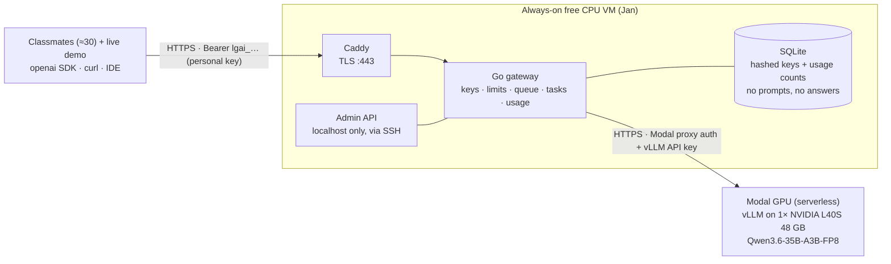
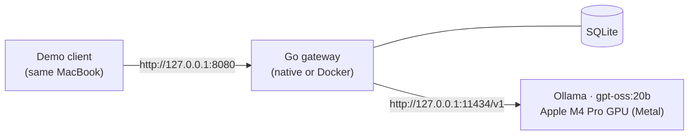

# Presentation notes for Giulia

**Topic:** local generative AI for coding, delivered as an API.
**One-sentence pitch:** we run an open-weights coding model on hardware we control, behind our own OpenAI-compatible Go gateway, and 30 classmates use it with personal keys, for €0.

Sources: `PRD.md`, `DECISIONS.md`, `reviews/critic.md`, `reviews/security.md`, `research/model-choice.md`, `research/performance.md`, and the lead's measurements of 2026-10-01.

---

## 1. Architecture

**Server mode** (the lab):

**Laptop mode** (development and the offline fallback demo):

The gateway is the same binary in both modes. Only its configuration (`LGAI_UPSTREAM_BASE_URL`, `LGAI_MODELS`) changes.

## 2. Why each choice (one line each)

| Choice | Why |
|---|---|
| **Our Go gateway, not vLLM exposed directly** | vLLM's own `--api-key` is a single shared key that doesn't cover every route (`/invocations` stays open). We need per-person revocable keys, quotas, usage stats without content, a fair queue and task prompts, and Go is our agreed stack (PRD), giving one 21.9 MB static binary. |
| **Gateway on a separate always-on VM** | Keys and usage live in SQLite on a persistent disk. If the GPU restarts or we switch provider, students keep the same URL and key. |
| **Modal, not OVHcloud** | Modal lets us set a **hard cap**: Workspace budget $28 + spend limit $0 out of pocket. OVH bills the card automatically once its trial credit is used, and doesn't say the credit covers its model-serving product. That breaks our €0 rule. |
| **Qwen3.6-35B-A3B (FP8) on an L40S** | Apache-2.0 open weights. 35 B parameters, only ~3 B active per token (mixture of experts), so it handles 30 users' prompts quickly. Leads its size class on multi-language coding benchmarks (SWE-bench Multilingual 67.2 vendor-reported, 63.4 measured by NVIDIA). Fits a 48 GB GPU in FP8 (37.5 GB). Fallback on the same GPU: Qwen3-Coder-30B-A3B. |
| **Request allowlist (security)** | The gateway rebuilds every request from validated fields instead of forwarding raw JSON. Example: `chat_template_kwargs` may contain only `enable_thinking`, because of **CVE-2025-61620** (a Jinja template smuggled through `chat_template_kwargs`, fixed in vLLM 0.11.0) and **CVE-2025-62426** (`tokenize: true` blocks vLLM's event loop for everyone, fixed in 0.11.1). Images and other non-text parts are refused too (SSRF risk). |
| **Queue + `Retry-After` instead of failing** | One GPU runs about 30 answers at once. The gateway lets 30 through, queues up to 24 more for ≤ 30 s, then answers `503` + `Retry-After: 10`. The per-key limit (6/min) answers `429` + `Retry-After`. The OpenAI SDK waits and retries by itself, so overload becomes a short pause, not a crash. |

## 3. Measured numbers

> ⚠️ **Laptop + tiny test model.** MacBook Pro M4 Pro 24 GB, Ollama 0.32.12, model `qwen2.5-coder:1.5b` (a 1.5 B test model, **not** the lab model), `OLLAMA_NUM_PARALLEL=4`, context 8,192, all through our gateway. These numbers show that **the gateway works and adds no visible delay**. They say nothing about the lab model's speed or quality. **GPU numbers: TBD at rehearsal.**

**Smoke test** (20 sequential requests, 4 tasks × 5 languages):

| Metric | Result |
|---|---|
| Time to first token (TTFT) | p50 0.34 s, p95 0.42 s |
| Generation speed | 137 tok/s per stream, 124 tok/s aggregate |
| Verdicts | 15 PASS, 5 WARN: `review` answers were cut at 768 tokens, so the default is now 1,024 |

**Load test** (8 concurrent clients for 40 s, Ollama has 4 slots):

| Metric | Result |
|---|---|
| Requests | 16/16 OK, 0 errors |
| TTFT | p50 12.9 s, p95 21.5 s |
| Per-stream speed | p50 39.9 tok/s |
| Aggregate | 151 tok/s |

The high TTFT is **queueing by design**: 4 requests generate while 4 wait at the gateway. Twice the capacity produced waiting, not errors.

**Container:** a 21.9 MB distroless image that runs as a non-root user (uid 65532), with a read-only filesystem and all Linux capabilities dropped. It reaches the host's Ollama via `host.docker.internal`.

**Security behaviour verified live:**

| Check | Result |
|---|---|
| Bad key, or key in the URL query string | `401` |
| Admin path on the public port | `404` |
| Wrong admin token | `403` |
| `n=2` (multiple answers) | `400` |
| After a burst of 3 requests | `429` + `Retry-After: 10` |
| Maintenance switch on | `503` |
| Revoke by name prefix | key gets `401` |
| Gateway log | no prompt text, no keys |

The official `openai` Python client works unchanged: model list, chat, streaming with usage, and task calls.

An independent code review found 0 critical issues and 1 major issue (fix in progress).

### GPU numbers: fill in at rehearsal (`loadtest -c 30`, through the public URL)

| Metric | Target (GO) | Measured |
|---|---|---|
| Per-user generation speed at 30 users, p50 | ≥ 12 tok/s (PRD: ≥ ~10) | TBD |
| Time to first content, p95 | ≤ 5 s | TBD |
| "Everyone clicks at once" burst, TTFT p95 | ≤ 20 s | TBD |
| Errors (excluding 429/503) | 0 % | TBD |
| Money spent (Modal ledger) | €0 out of pocket | TBD |

Our pre-rehearsal **estimate** for L40S × Qwen3.6 is **≈ 13–17 tok/s per user** with 30 streaming at once and **≈ 3–6 s** TTFT in a burst (critic's back-of-envelope, not measured). Show it only as an estimate, next to the real numbers.

## 4. What local / open coding models are good and bad at (our rules of thumb)

These come from our model research and testing, not from a formal study.

**Good at:**
- explaining a function or a compiler error in plain words;
- spotting classic bugs in a snippet: off-by-one, null/None, resource leaks, `strcpy` overflows, ignored errors in Go;
- writing unit-test scaffolding for a small function (pytest, JUnit, Go table tests, GoogleTest);
- idiomatic rewrites and boilerplate;
- answering in seconds, privately, with no per-token bill.

**Weak at:**
- anything bigger than what fits in the prompt (whole repositories, multi-file design);
- niche or recent library APIs: it invents functions confidently;
- subtle concurrency or undefined-behaviour claims: always verify;
- hard reasoning compared with frontier models, especially with "thinking" turned off for speed, as we do;
- consistency: the same question can get a different answer.

**From Slava's own month of running local models daily** (MacBook M4 Pro, gpt-oss:20b + qwen2.5-coder):
- **Rule of thumb:**
  - If you already know what the answer should look like and just don't want to type it, use **local**.
  - If you're asking because you don't know, use a **frontier** model.
- **Facts from tools, judgement from the model.** It wrote `if err := rows.Close(); err != nil` for a pgx method that returns nothing, and reported a test-coverage number it never measured. It gave no sign of uncertainty either time. Only the compiler or a real command caught it. That's why our task endpoints are best paired with "now run it".
- **Live example from our own test:** asked to `review` `def avg(xs): return sum(xs)/len(xs)`, the 1.5 B test model answered "correct, no bugs". It missed the `ZeroDivisionError` on an empty list. This makes a good slide on why model size matters.
- **Thinking costs time.** With reasoning on high, gpt-oss spent its whole token budget thinking and printed nothing. We run thinking off / low.

**Size matters a lot:**
- The 1.5 B test model is fast but shallow.
- The ~35 B lab model is the sweet spot for one 48 GB GPU.
- Frontier models are far larger and not open.

## 5. Likely questions (short answers)

| Question | Answer |
|---|---|
| **What did it cost?** | €0. Modal gives $30 of compute per month. We set a $28 usage budget and a $0 out-of-pocket spend limit, so the card cannot be charged. The gateway VM is on a free tier. One L40S hour costs roughly $2.40, and our whole plan is about 9 GPU-hours, roughly $22 (estimate). *(Replace with the real ledger after the lab.)* |
| **Is my code private?** | We never store or log prompts or answers, only counts per key (tokens, timing, status). Keys are stored hashed and named by seat, not by person. Honest caveat: traffic passes, encrypted, through our VM provider and Modal's GPU container. It is self-hosted on rented hardware, not on-premises. For truly confidential code, laptop mode keeps everything on one machine. |
| **Why not just use ChatGPT?** | The topic is running AI ourselves: open weights we can inspect, reproduce and run offline. There's no vendor lock-in and no per-token bill, we control the data path, and the same API runs on a laptop with no internet. |
| **Is it as good as ChatGPT / Claude?** | No, and we don't claim it is. It is solid for snippet-level explain/review/tests/fix, and weaker on hard reasoning and big codebases. The published benchmark numbers are vendor-reported and use stronger settings than our fast "thinking off" mode. |
| **Is a rented cloud GPU still "local"?** | Local here means self-hosted open weights under our control, not a third-party AI API. We show the exact same service on a MacBook with no network. *(We asked the professor to confirm this reading.)* |
| **What if the GPU dies during the lab?** | Keys live on the VM, so a GPU restart keeps everyone's URL and key. The runbook ladder: <ul><li>wait for an automatic restart (≤ 5 min);</li><li>switch to a standby GPU, if funded (≤ 10 min);</li><li>laptop demo plus pair work;</li><li>recorded video.</li></ul> |
| **How many users can one GPU take?** | About 30 at once at reading speed (rehearsal number TBD). Beyond that, requests queue for a few seconds instead of failing. The laptop alone handles about 5. |
| **How do you stop abuse?** | <ul><li>Personal keys with expiry;</li><li>6 requests/min and 2 parallel requests per key;</li><li>300k tokens per key per day;</li><li>instant revocation (one key or a whole batch);</li><li>a maintenance kill switch;</li><li>the provider's hard spend cap.</li></ul> |
| **Why Go?** | It's the stack we agreed on in the PRD, and it fits: one small static binary, cheap concurrency for streaming, standard-library HTTP, and SQLite in a single file. |
